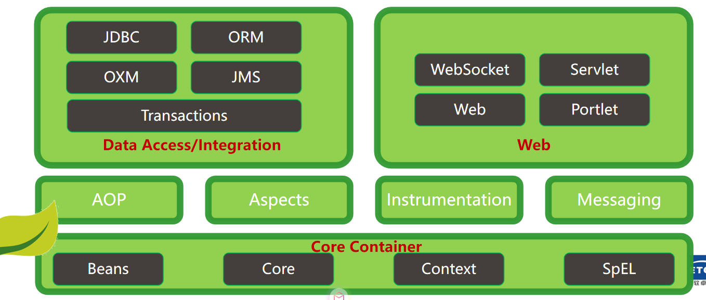
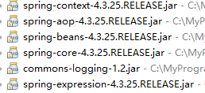
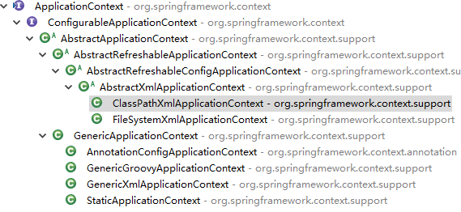

# 一、Spring入门

### 1、什么是Spring?了解Spring的特点？了解Spring体系？

​		Spring 是一个开源框架，中文意思就是春天，也许是作者想让自己的这个框架给Java开发人员带来春天吧。其官方网站是 https://spring.io/ ，可以在官方网站下载到完整的类库，源代码以及文档，它的图标是一片叶子。

**Spring的特点：**

- 轻量级
  - Spring 是非侵入性的 - 基于 Spring 开发的应用中的对象可以不依赖于 Spring 的 API
- 依赖注入(DI --- dependency injection、IOC)
- 面向切面编程(AOP --- aspect oriented programming)
- 容器
  - Spring 是一个容器, 因为它包含并且管理应用对象的生命周期
- 框架
  - Spring 实现了使用简单的组件配置组合成一个复杂的应用
  -  在 Spring 中可以使用 XML 和 Java 注解组合这些对象
- 一站式
  - 在 IOC 和 AOP 的基础上可以整合各种企业应用的开源框架和优秀的第三方类库 （实际上 Spring 自身也提供了展现层的 SpringMVC 和 持久层的 Spring JDBC）

**Spring体系结构**：Spring建立了一个灵活的可热插拔的组件结构。




### 2、理解IOC/DI？

​      IoC (Inversion of Control)，控制反转，用白话来讲，就是由容器控制程序之间的关系，而非传统实现中，由程序代码直接操控。这也就是所谓“控制反转”的概念所在：控制权由应用代码中转到了外部容器，控制权的转移，是所谓反转；

​	相对IoC而言，“依赖注入DI (Dependency Injection)”的确更加准确的描述了这种古老而又时兴的设计理念。从名字上理解，所谓依赖注入，即组件之间的依赖关系由容器在运行期决定，形象的来说，即由容器动态的将某种依赖关系注入到组件之中；


### 3、理解什么是AOP？

​	AOP，Aspect Oriented Programming：
​	面向切面编程，通过预编译方式和运行期动态代理实现程序功能的统一维护的一种技术。AOP是OOP的延续，是软件开发中的一个热点，也是Spring框架中的一个重要内容，是函数式编程的一种衍生范型。利用AOP可以对业务逻辑的各个部分进行隔离，从而使得业务逻辑各部分之间的耦合度降低，提高程序的可重用性，同时提高了开发的效率；
​	在Spring中提供了面向切面编程的丰富支持，允许通过分离应用的业务逻辑与系统级服务（例如事务管理）进行内聚性的开发。应用对象只实现它们应该做的：完成业务逻辑，仅此而已。它们并不负责（甚至是意识）其它的系统级关注点，例如日志或事务支持；

### 4、构建Spring环境

1. 导入相应jar包

   

   ```xml
   <!-- 可以直接添加Spring上下文jar包，其他依赖包会自动下载 -->
   <dependency>
       <groupId>org.springframework</groupId>
       <artifactId>spring-context</artifactId>
       <version>4.3.25.RELEASE</version>
   </dependency>
   ```

2. 构建ApplicationContxet.xml

   ```xml
   <?xml version="1.0" encoding="UTF-8"?>
   <beans xmlns="http://www.springframework.org/schema/beans"
   	xmlns:xsi="http://www.w3.org/2001/XMLSchema-instance"
   	xmlns:aop="http://www.springframework.org/schema/aop"
   	xmlns:context="http://www.springframework.org/schema/context"
   	xmlns:p="http://www.springframework.org/schema/p"
   	xsi:schemaLocation="http://www.springframework.org/schema/beans http://www.springframework.org/schema/beans/spring-beans.xsd
   		http://www.springframework.org/schema/aop http://www.springframework.org/schema/aop/spring-aop-4.3.xsd
   		http://www.springframework.org/schema/context http://www.springframework.org/schema/context/spring-context-4.3.xsd">
   
   
   </beans>
   ```

3. 启动Spring容器

   ```java
   // 启动Spring容器
   ClassPathXmlApplicationContext cx = new ClassPathXmlApplicationContext("ApplicationContext.xml");
   ```


### 5、Spring  Bean的构建

##### 1、如何构建Bean？

**1）无参构造方法实现Bean**

```java
// User userBean = new User();   多例
//  默认情况是单例
<bean id="userBean" class="com.chinasofti.model.User" ></bean>
```

**2）静态工厂实现Bean(注意：返回类型是方法的类型，而不是类)**

```java
public interface Person {
	String doSomething();
}

public class Boy implements Person {
	@Override
	public String doSomething() {
		return "男孩力气大，可以干体力活";
	}
}

public class Girl implements Person {
	@Override
	public String doSomething() {
		return "女孩干活比较细心";
	}
}

public class PersonStaticFactory {
	public PersonFactory() {
		System.out.println("PersonFactory实例化了");
	}
	
	public static String Peixun() {
		int flag = 1;
		Person person = null;
		if(flag == 0) {
			person = new Girl();
		}else {
			person = new Boy();
		}
		return person.doSomething();
	}
}
```

```xml
<bean id="staticperson" class="com.chinasofti.factory.PersonStaticFactory" factory-method="Peixun" ></bean>
```

**3）实例工厂实现Bean(注意：返回类型是方法的类型，而不是类)**

```java
public class PersonFactory {
	public PersonFactory() {
		System.out.println("PersonFactory实例化了");
	}
	
	public String Peixun() {
		int flag = 1;
		Person person = null;
		if(flag == 0) {
			person = new Girl();
		}else {
			person = new Boy();
		}
		return person.doSomething();
	}
}
```

```xml
<bean id="personFactory" class="com.chinasofti.factory.PersonFactory2"></bean>
<bean id="person" factory-bean="personFactory" factory-method="Peixun"></bean>
```


##### 2、如何获取Bean？

- getBean(“标识[id /name]”) :BeanFactory提供了通过容器获取Bean实例对象的方法，ApplicationContext派生自BeanFactory，因此ClassPathXmlApplicationContext也具备同样的方法。



- 配置bean的xml文件可进行分拆，多个部分多系统的模块化分拆是非常有用的。

```xml
<import resource="others.xml"/>
```


##### 3、bean的作用域

- singleton：在每个Spring IoC容器中一个bean定义对应一个单例对象实例


容器启动时，就会构建实例，Spring容器会管理Bean的生命周期

- prototype：一个bean定义对应多个对象实例（每次使用该Bean构建一个新的对象）


容器启动时，不会构建实例，当调用过程时，会产生实例

- request：每次HTTP请求将会构建各自的bean实例（Web环境中生效，需要配置监听器）

```xml
<listener>
  	<listener-class>
        org.springframework.web.context.request.RequestContextListener</listener-class>
</listener>
```

- session：在一个HTTP Session中，一个bean定义对应一个实例（Web环境中生效）


##### 4、自定义作用域（Scope）-了解

1. 实现Scope接口

   ```java
   public class ThreadScope implements Scope {
       // 利用ThreadLocal工具在当前线程中共享数据(说明当前实现的作用域为Thread)
   	private final ThreadLocal<Map<String, Object>> threadScope = new ThreadLocal<Map<String, Object>>() {
   		@Override
   		protected Map<String, Object> initialValue() {
   			return new HashMap<String, Object>();
   		}
   	};
       // 从作用域中取出数据
   	public Object get(String name, ObjectFactory<?> objectFactory) {
   		Map<String, Object> scope = threadScope.get();
   		Object obj = scope.get(name);
   		if (obj == null) {
   			obj = objectFactory.getObject();
   			scope.put(name, obj);
   		}
   		return obj;
   	}
       // 销毁实例对象
   	public Object remove(String name) {
   		Map<String, Object> scope = threadScope.get();
   		return scope.remove(name);
   	}
   	public void registerDestructionCallback(String name, Runnable callback) {}
   	public Object resolveContextualObject(String key) {return null;	}
   	public String getConversationId() {	return null;}
   }
   ```
   
2. 在容器中，需要注册，自定义作用域

   ```java
   // 启动Spring容器
   ClassPathXmlApplicationContext cx = new ClassPathXmlApplicationContext("ApplicationContext.xml");
   // 实例化自定义Scope
   ThreadScope ts = new ThreadScope();
   // 注册自定义Scope到容器
   cx.getBeanFactory().registerScope("thread", ts);
   ```

# 二、Spring IOC

#### 1、依赖注入的几种方式？

1. Setter注入

   - 必须有Setter方法

   - ```xml
     <bean id="userBean" class="com.chinasofti.bean.User"  >
         <property name="uid" value="1" />
         <property name="uname"  value="kwj" />
     </bean>
     
     <bean id="userBean" class="com.chinasofti.bean.User"
           p:uid = "1"
           p:uname="kwj"
           >
     </bean>
     ```

2. 构造器注入

   - 必须有对应构造方法

   - ```xml
     <bean id="userBean2" class="com.chinasofti.bean.User"  >
     		<constructor-arg  value="11"  index="0" />
     		<constructor-arg  value="kwj" index="1" />
     </bean>
     ```

3. 工厂方法注入(factory-bean, factory-method)

4. 接口注入：通过接口依赖注入属性，会大幅度增加冗余代码量，不推荐使用

#### 2、bean的生命周期？

- 如果scope为默认值，bean的构建，随着容器的启动而构建，随着容器的关闭而结束

- 如果scope不为默认值，bean的构建，调用的时候进行构建，jvm自动回收，spring容器并不清楚什么时候回收

- 如果单例的bean（A），调用多例的bean，（B）会出现，A调用的不是最新的B的实例

  - ```xml
    <bean id="b" class="com.chinasofti.bean.B" scope="prototype">
        <aop:scoped-proxy/> <!-- 添加作用域代理 -->
    </bean>
    
    <bean id="a" class="com.chinasofti.bean.A">
        <property name="b"  ref="b" ></property>
    </bean>
    ```

  - ```java
    public abstract class A {
        // 添加抽象方法
        public abstract B createB();
     
        private B b;
        public B getB() {
    		b = createB();
    		return b;
    	}
    	public void setB(String b) {
    		this.b = b;
    	}  
    }
    
    <bean id="b" class="com.chinasofti.bean.B" scope="prototype"></bean>
    
    <bean id="a" class="com.chinasofti.bean.A"  >	
    	<lookup-method  bean="b"  name="createB" />
    </bean>
    
    ```

    

